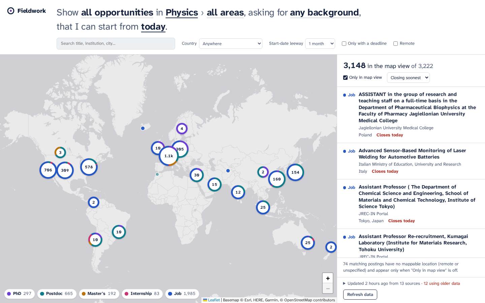

# Fieldwork: STEM opportunities on a map

Fieldwork is a job-search site for physics, chemistry, mathematics and engineering. Every
open **PhD position, postdoc, master's programme, internship and job** it finds is a point on a world
map. Click a point to see the posting, filter by field and subfield, and ask for
"only postings that explicitly want a physics degree". You can also say when you are available,
so that only opportunities you can still apply to and actually start are shown.

The data comes from **scrapers**, not from an AI model searching the web on every visit. A
refresh costs only bandwidth: a GitHub Actions job runs the scrapers daily, and you can trigger
one yourself at any time.



## What you can do

| You want to… | How |
| --- | --- |
| See where opportunities are | Clustered world map. Each cluster ring shows the mix of types (PhD, postdoc, master's, internship, job) inside it. |
| Choose the type | The first control in the query sentence, or the legend chips on the map (multi-select). |
| Pick a field and a subfield | e.g. *Physics › Quantum Computing & Information*, *Physics › Surface & Interface Physics*, *Electrical Engineering › Embedded Systems & FPGA*. 13 disciplines, ~90 subfields. |
| Find postings that ask for **your** background | "asking for **a physics degree**" keeps postings whose requirements explicitly name that degree (e.g. "MSc in Physics or a related field", "we are looking for a physicist"). |
| Only see things you can start | "that I can start from **date**": deadlines must be on or after that date, and known start dates must not be earlier than it (minus an adjustable leeway). |
| Narrow further | Free-text search, country, remote only, "only with a deadline", sort by closing date, newest or start date. |
| Share a search | Filters live in the URL. Copy it. |

### Date rules, precisely

Given the date you are available from (`D`, never earlier than today):

* **Deadline:** a posting with a deadline is shown only if `deadline ≥ D`. Postings without a
  stated deadline are shown unless you tick *Only with a deadline* (most companies do not
  publish one).
* **Start date:** a posting with a known start date is shown only if `start ≥ D − leeway`
  (leeway: none, 1, 3 or 6 months; default 1 month). Unknown or "as soon as possible" starts
  are kept, because they are usually negotiable.
* Expired postings (deadline before today) are dropped by the scraper.

## Data sources

| Source | Covers | Method |
| --- | --- | --- |
| [EURAXESS](https://euraxess.ec.europa.eu/jobs/search) | PhD, postdoc, master's and research positions, mostly in Europe | Listing crawl + detail page per posting (cached), polite rate limit |

*More sources are being added. The table is updated as they land.*

Every source returns the same normalized record. Classification is rule-based (keywords
plus each source's own field labels; see `scraper/jobfinder/taxonomy.py`), and locations are
geocoded **offline** against the GeoNames gazetteer, so there are no API keys and no rate limits.

Scrapers are deliberately polite. They identify themselves in the User-Agent, throttle per host,
back off on HTTP 429, never log in or bypass protections, and skip sites whose robots rules or
responses say no.

## Running it locally

Requirements: Python 3.11+ and Node 20+.

```bash
# 1. Scrape (first run downloads GeoNames ~10 MB and caches detail pages; later runs are incremental)
cd scraper
pip install -r requirements.txt
python -m jobfinder scrape                  # all sources
python -m jobfinder scrape --only euraxess  # one source
python -m jobfinder scrape --limit 30       # quick smoke test (doesn't overwrite snapshots)
python -m jobfinder sources                 # list sources

# 2. Build and serve the site, with a "Refresh data" button wired to the scrapers
cd ../web
npm install
npm run build
cd ../scraper
python -m jobfinder serve                   # http://127.0.0.1:8000
```

For frontend development, run `npm run dev` in `web/`. It proxies `/api` to the Python server
on port 8000, so start `python -m jobfinder serve` too if you want the refresh button.

Tests:

```bash
cd scraper && python -m pytest -q   # parsers, classifier, date rules, geocoder
cd web && npm test                  # filter logic (date rules, URL state)
```

## Deployment (GitHub Pages)

`.github/workflows/update.yml` runs the tests and scrapers, builds the site and publishes it to
GitHub Pages:

* every day at 04:17 UTC,
* on every push to `main` that touches `scraper/`, `web/` or the workflow,
* on demand from **Actions → Scrape and deploy → Run workflow**. This is the "refresh now"
  button for the hosted site.

Detail-page caches and per-source snapshots are kept between runs with the Actions cache, so
daily runs only fetch new postings. If a source fails or returns nothing, the previous snapshot
is reused (minus expired postings) and the site marks that source as "from an earlier run".

One-time setup: **Settings → Pages → Build and deployment → Source: GitHub Actions**.

## Project layout

```
scraper/
  jobfinder/
    taxonomy.py      disciplines, subfields, keywords, degree terms, EURAXESS field mapping
    classify.py      kind (PhD/postdoc/…), fields, required background, education level
    dates.py         date parsing, deadline/start extraction from free text
    geocode.py       offline GeoNames geocoder (handles "Boulder, CO", "Munich, DE", "Remote - US")
    models.py        Opportunity / Location records and the compact public JSON form
    pipeline.py      runs sources in parallel → normalize → filter → dedupe → JSON
    server.py        local static server + /api/refresh
    http.py          polite HTTP session (per-host throttle, adaptive 429 backoff)
    sources/         one module per source, auto-registered
  tests/
web/
  src/
    App.tsx          state, URL sync, layout
    QueryBar.tsx     the query sentence and refinements
    MapView.tsx      Leaflet map, clustered pins, kind-mix cluster rings
    Results.tsx      list synced with the map view
    Detail.tsx       one opportunity
    filters.ts       filter + date rules (unit-tested)
  public/data/opportunities.json   generated, not committed
data/                caches, snapshots, gazetteer (not committed)
```

## Adding a source

1. Create `scraper/jobfinder/sources/<name>.py` with a `Source` subclass that sets `id`,
   `name` and `homepage`, and implements `fetch()` yielding `Opportunity` objects. Use
   `self.http` (polite session), `geocode()` for locations, `parse_date()` for dates, and
   `DetailCache` if you need one request per posting.
2. Fill what the source knows (deadline, start, kind hint, its own field labels in
   `source_fields`, explicitly required degrees). The pipeline infers the rest and drops
   non-STEM and expired postings.
3. `python -m jobfinder scrape --only <name> --limit 30`, check the output, add a parser test.

The registry discovers the module automatically. To add a subfield, edit `taxonomy.py`. The
frontend reads the taxonomy from the data file, so it appears in the UI with no frontend change.

## Data format

`web/public/data/opportunities.json`:

```jsonc
{
  "generated": "2026-10-09T04:30:00+00:00",
  "taxonomy": [{ "id": "physics", "label": "Physics", "subfields": [{ "id": "quantum-computing", "label": "…" }] }],
  "kinds": [{ "id": "phd", "label": "PhD" }],
  "sources": [{ "id": "euraxess", "name": "EURAXESS", "ok": true, "count": 4210 }],
  "items": [{
    "id": "3f9c…", "source": "euraxess", "url": "https://…", "title": "PhD position in …",
    "org": "…", "kind": "phd", "summary": "first ~360 characters",
    "locs": [{ "city": "Delft", "country": "Netherlands", "country_code": "NL", "lat": 52.0, "lon": 4.36, "precision": "city" }],
    "posted": "2026-10-01", "deadline": "2026-11-30", "start": "2027-02-01",
    "disc": ["physics"], "sub": ["quantum-computing"], "req": ["physics", "electrical-engineering"],
    "edu": "masters"
  }]
}
```

## Limitations

* Classification is keyword-based. It is fast, free and transparent, but it occasionally
  mislabels a posting. Every posting links to its original.
* "Required background" only catches postings that state it in words the rules recognise.
  A posting that doesn't say which degree it wants never matches a background filter.
* Locations without a city are placed at the country's capital and drawn as faded, dashed pins.
